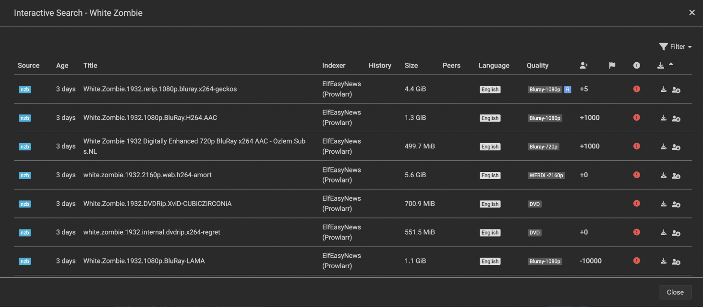
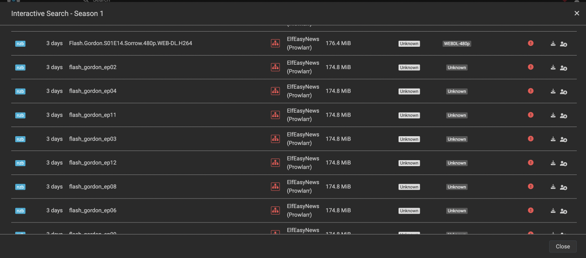
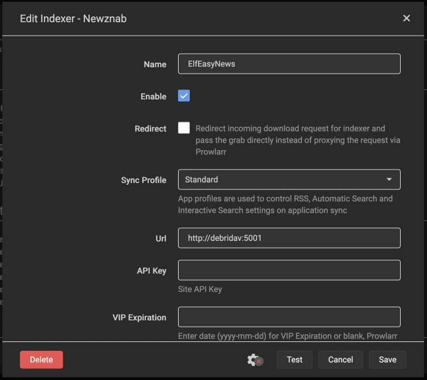

# FakeArr

FakeArr is a "workalike" implementation of Puks' original fake-torrent-server. It is designed to work seamlessly with [DebriDav](https://github.com/skjaere/DebriDav) and EasyNews, but instead of requiring a separate Prowlarr indexer definition, it functions as a NewzNab indexer.

FakeArr is used in the [ElfHosted EasyNews bundles](https://store.elfhosted.com/product-category/streaming-bundles/debrid-provider/easynews/), or as an [optional addon](https://store.elfhosted.com/product/debridav/) to any other ElfHosted stack, as demonstrated at https://www.youtube.com/watch?v=IkKQB61TL6I&t=7s

Grab a [7-day trial for $1](https://store.elfhosted.com/product/hobbit-plex-easynews-aars/) and see for yourself :)

## Features

- Acts as a NewzNab indexer for seamless integration.
- Compatible with DebriDav, Radarr, Sonarr, and Prowlarr.
- Supports both [EasyNews+](https://github.com/Sleeyax/stremio-easynews-addon) and [EasyNews++](https://github.com/panteLx/easynews-plus-plus).
- Provides fake NZB files for testing and development purposes.

## Screenshots

Here's what FakeArr can enable in Radarr/Sonarr:





And here's how to enable it in Prowlarr:



## Environment Variables

To configure FakeArr, set the following environment variables:

| Variable            | Default Value                                   | Description                                   |
|---------------------|-------------------------------------------------|-----------------------------------------------|
| `EASYNEWS_VERSION`  | `plus`                                          | Choose between `plus` (Sleeyax) or `plusplus` (panteLx).                     |
| `EASYNEWS_ADDON_URL`| `http://elfhosted-internal.easynewsplus`        | Base URL of the Stremio EasyNews addon.       |
| `EASYNEWS_USERNAME` | `default_user`                                  | Username for EasyNews authentication.         |
| `EASYNEWS_PASSWORD` | `default_pass`                                  | Password for EasyNews authentication.         |
| `FAKEARR_BASE_URL`  | `http://debridav:5001`                          | Base URL for FakeArr. Needs to be reachable from Aars.                       |

### Optional: EasyNews+ (Sleeyax) specific

| Variable               | Default       | Description             |
|------------------------|---------------|-------------------------|
| `EASYNEWS_SORT1`       | `Size`        | Primary sort field      |
| `EASYNEWS_SORT1_DIR`   | `Descending`  | Sort direction          |
| `EASYNEWS_SORT2`       | `Relevance`   | Secondary sort field    |
| `EASYNEWS_SORT2_DIR`   | `Descending`  | Sort direction          |
| `EASYNEWS_SORT3`       | `Date & Time` | Tertiary sort field     |
| `EASYNEWS_SORT3_DIR`   | `Descending`  | Sort direction          |

### Optional: EasyNews++ (panteLx) specific

| Variable                             | Default                      | Description                                           |
|--------------------------------------|------------------------------|-------------------------------------------------------|
| `EASYNEWS_UI_LANGUAGE`               | `eng`                        | Interface language                                    |
| `EASYNEWS_STRICT_TITLE_MATCHING`     | `on`                         | Whether strict title matching is enabled              |
| `EASYNEWS_PREFERRED_LANGUAGE`        | ``                           | Preferred audio language                              |
| `EASYNEWS_SORTING_PREFERENCE`        | `quality_first`              | Sorting method (quality, language, size or date)      |
| `EASYNEWS_SHOW_QUALITIES`            | `4k,1080p,720p,480p`         | Qualities to include                                  |
| `EASYNEWS_MAX_RESULTS_PER_QUALITY`   | ``                           | Max results per quality                               |
| `EASYNEWS_MAX_FILE_SIZE`             | ``                           | Max file size in GB                                   |

## Getting Started

1. Clone the repository:
   ```bash
   git clone https://github.com/your-repo/fakearr.git
   cd fakearr
   ```
2. Install dependencies:
   ```bash
   pip install -r requirements.txt
   ```
3. Run FakeArr!
   ```bash
   python fakearr.py
   ```
4. Access the API at http://localhost:5001/api

## Using Docker

```
docker run -d -p 5001:5001 \
  -e EASYNEWS_VERSION=plus \
  -e EASYNEWS_ADDON_URL=https://easynewsplus.elfhosted.com \
  -e EASYNEWS_USERNAME=my_user \
  -e EASYNEWS_PASSWORD=my_pass \
  -e FAKEARR_BASE_URL=http://fakearr:5001 \
  --name fakearr ghcr.io/elfhosted/fakearr:rolling
  ```
You can also add additional parameters for EasyNews+ (e.g. `EASYNEWS_SORT1`, `EASYNEWS_SORT2`, etc.) and EasyNews++ (e.g. `EASYNEWS_STRICT_TITLE_MATCHING`, `EASYNEWS_SORTING_PREFERENCE`, etc.) depending on the EasyNews addon you are using.

Refer to `sample.env` for a complete list of supported environment variables.

## License

This project is licensed under the **Creative Commons Attribution-NonCommercial 4.0 International (CC BY-NC 4.0)** license.

You are free to:
- **Share** — copy and redistribute the material in any medium or format.
- **Adapt** — remix, transform, and build upon the material.

**Under the following terms**:
- **Attribution** — You must give appropriate credit, provide a link to the license, and indicate if changes were made.
- **NonCommercial** — You may not use the material for commercial purposes.

For more details, see the full license text at [https://creativecommons.org/licenses/by-nc/4.0/](https://creativecommons.org/licenses/by-nc/4.0/).

# Acknowledgments

* Inspired by Puks The Pirate's original fake-torrent-server. See Puk's work at https://savvyguides.wiki/
* EasyNews+ is made possible by [Sleeyax](https://github.com/sleeyax/stremio-easynews-addon)
* EasyNews++ is made possible by [panteLx](https://github.com/panteLx/easynews-plus-plus)
